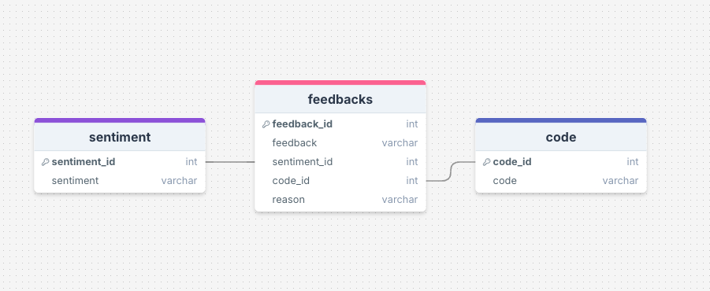
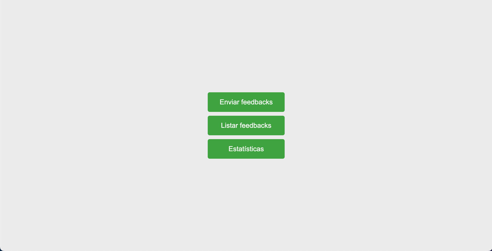
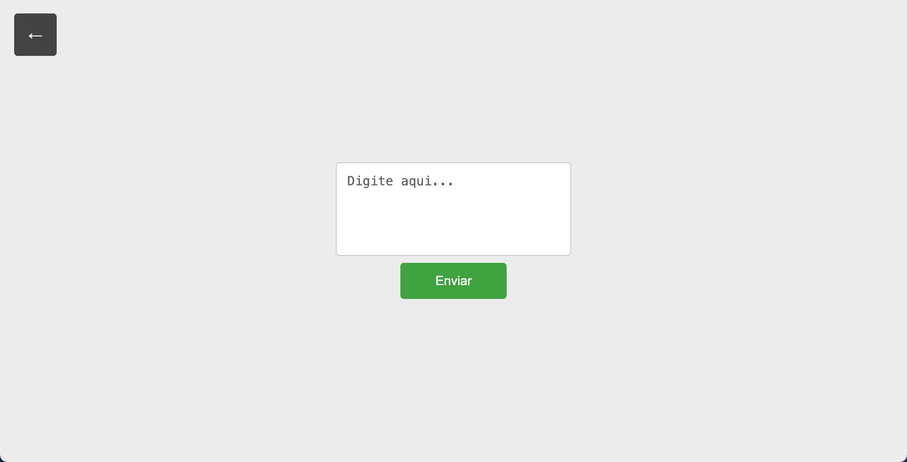
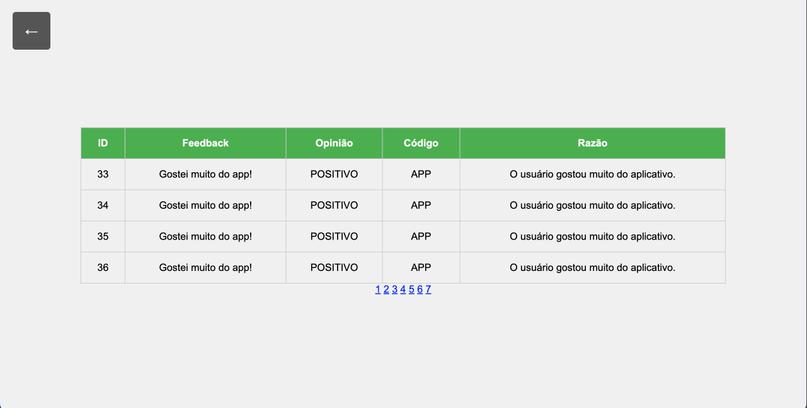
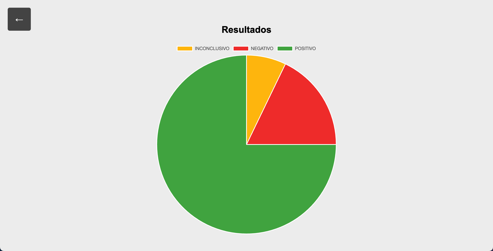

# Alumind - Feedback Analyzer

Este projeto tem como objetivo analisar feedbacks e visualizar estatísticas sobre as opiniões dos usuários de um aplicativo da empresa AluMind, que é focado em bem-estar e saúde mental, proporcionando aos usuários acesso a meditações guiadas, sessões de terapia, e conteúdos educativos sobre saúde mental.

# Índice
1. [Features](#features)
2. [Estrutura](#estrutura)
3. [Telas](#telas)
4. [Ferramentas](#ferramentas)
5. [Endpoints](#endpoints)
6. [Execução](#exec)
7. [Decisões de projeto](#projeto)
8. [Melhorias possíveis](#melhorias)

## Features <a id="features"/>

Para as features, serão utilizadas convenções de engenharia de software para facilidar a compreensão.

Requisitos funcionais do sistema:
 - RF01: O aplicativo deve ser capaz de receber feedbacks em um endpoint /feedback com método POST.
 - RF02: O aplicativo deve ser capaz de retornar no endpoint /feedback uma estrutura que informe o id, sentiment, code e reason.
 - RF03: O aplicativo deve ser capaz de separar os feedbacks entre 'POSITIVO', 'NEGATIVO' e 'INCONCLUSIVO'.
 - RF04: O aplicativo deve ser capaz de gerar um código chamado code para as sugeridas.
 - RF05: O aplicativo deve ser capaz de armazenar o feedback, bem como o sentiment e o code no banco de dados.
 - RF06: O aplicativo não deve ser capaz de processar SPAMs.
 - RF07: O aplicativo deve ter interface web para visualizar os feedbacks armazenados em banco com todas as suas informações visíveis.
 - RF08: O aplicativo deve ter interface web para exibir estatísticas dos sentiments analisados.
 - RF09: O aplicativo deve ter interface web para envio de feedbacks.
 - RF10: O aplicativo deve possuir botões de voltar para que se possa navegar entre as funcionalidades.
 - RF11: O aplicativo deve possuir testes unitários para as rotas definidas.

Requisitos não funcionais do sistema:
- RNF01: O código deve seguir o padrão da documentação da biblioteca Flask, para garantir facilidade na manutenção.

## Estrutura <a id="estrutura"/>
A estrutura do projeto seguiu os padrões recomendados pela documentação da biblioteca Flask. Sendo assim, dividiu-se em:

- Main: Inicia o app e levanta os serviços
- Database: possui o arquivo para inicialização do banco, bem como valores pré-definidos para algumas tabelas.
- Endpoits: possui os endpoints (ou rotas, como denominado na documentação da biblioteca Flask) para a análise dos feedbacks, bem como para as páginas que foram desenvolvidas.
- Static: possui os arquivos de estilos CSS e scripts JavaScript (vazio, conforme informado em [[Decisões de projeto](#projeto)])
- Templates: possui os arquivos HTML das páginas criadas para o projeto.
- Utils: possui as funções úteis para acesso ao banco de dados e de suporte a análise do feedback.
- Docs: possui arquivos de documentação do projeto.
- Tests: possui os arquivos com testes unitários da aplicação.

A estrutura do banco segue a seguinte modelagem: 



## Telas <a id="telas"/>

Visando uma melhor interação com o sistema, foi desevolvido algumas telas para suporte das operações.

A primeira tela consiste de um simples menu para seleção de operações:  



A primeira opção do menu retrata uma tela para envio de feedbacks, conforme a imagem a seguir:



Em seguida, temos uma tela simples com a listagem de todos os feedbacks cadastrados:



Por fim, temos a tela com as estatísticas obtidas a partir das avaliações cadastradas:



## Ferramentas <a id="ferramentas"/>

- Python 3.12
- Flask 3.0.3
- MySQL 9.0
- LangChain OpenAI 0.1.20 (usando o gpt-4o, preferencialmente)
- Git
- HTML, CSS, JS
- Pytest 8.3.2

Para o desenvolvimento do projeto, usou-se:
- Visual Studio Code, para programação
- Postman, para simular as requisições
- Google Chrome, para execução das páginas

Para documentação, foi usado:
- Conventional Commits, para padronização
- DrawSQL, para modelagem do banco

## Endpoints <a id="endpoints"/>

```json
URL: /feedback
Método: POST
{
    "feedback": "Gosto muito de usar o Alumind! Está me ajudando bastante em relação a
    alguns problemas que tenho. Só queria que houvesse uma forma mais fácil de eu mesmo
    realizar a edição do meu perfil dentro da minha conta"
}

Retorno:
{
    "id": 1,
    "sentiment": "POSITIVO",
    "requested_features": [
        {
            "code": "USAR_MEDITAÇÃO",
            "reason": "O usuário gostou das aulas de meditação e sentiu que elas ajudaram muito."
        }
    ]
} 
```

```json
URL: /home
Método: GET

Retorna a página principal
```

```json
URL: /send_feedback
Método: GET | POST

GET: Retorna a página de envio de feedbacks
POST: Recebe o texto do campo para gerar o feedback
```

```json
URL: /display_feedbacks
Método: GET

Retorna a página com a tabela de todos os feedbacks, bem como as informações geradas/coletadas
```

```json
URL: /display_statistics
Método: GET

Retorna a página com um gráfico mostrando a distribuição de sentiments
```

## Execução <a id="exec"/>

```bash
$ git clone https://github.com/ebsiqueira/case-alura.git

$ cd case-alura

$  pip install -r requirements.txt 

Antes de executar, é importante rodar o script de criação do banco de dados localizado em app/database/create_db.sql

É necessário também criar um arquivo .env dentro da pasta case-alura e adicionar o seguinte conteúdo:
API_KEY="sua_chave_para_api_open_ai"
MYSQL_USER="seu_usuario_bd"
MYSQL_PW="sua_senha_bd"
MYSQL_DB="alumind"
MYSQL_HOST="seu_host_bd"

Configurado o ambiente, pode-se executar o seguinte comando para rodar o projeto:
$ python main.py

Se for de desejo, pode ser totalmente operado pela interface a partir de http://127.0.0.1:5000/home
```
⚠️ É NECESSÁRIO POSSUIR CRÉDITOS NA CONTA DA OPENAI PARA EXECUTAR O PROJETO ⚠️

## Decisões de projeto <a id="projeto"/>

Algumas decisões de projeto foram tomadas ao longo do desenvolvimento, baseadas na interpretação do desafio técnico. As principais foram:

- No documento, é informado que a requisição para o endpoint /feedback é composta por um identificador e por um texto, porém no exemplo fornecido apenas o texto é passado. Assim, optou-se por seguir fielmente o exemplo e atribuir um id auto incrementado apenas quando fosse persistido no banco.

- Também no documento é informado que outro time ficará responsável por enviar os feedbacks para a aplicação. Mesmo com isso, optou-se por criar uma simples tela para adicionar feedbacks de maneira gráfica.

- Alguns testes foram feitos ao longo do desenvolvimento para a escolha da LLM. Foram testados Gemini (Google) e GPT (OpenAI). O Gemini, gratuito, apresentou ótimo resultado, porém um pouco perdido na identificação dos SPAMs. Sendo assim, testou-se o GPT-4o, com preço aproximado de $0.002 (Dólar americano) por requisição. Com ele, os resultados foram excelentes, principalmente no fator de identificação de conteúdo agressivo no SPAM (No Gemini, ao dizer que o app era ruim, por exemplo, já se enquadrava como ofensa, eliminando assim casos de opiniões negativas). Para ambos o valor de temperatura ideal encontrado foi de 0.1. 

- Optou-se por gerar o campo code, usando a LLM escolhida, a partir de cada requisição. Nos casos onde se repete, a repetição não é inserida no banco. Essa abordagem foi escolhida pois dois feedbacks podem, ao meu ver, sugerir a mesma coisa e assim teriam o mesmo código. Nesse cenário, o código ainda identifica unicamente a funcionalidade sugerida, mas não unicamente um feedback. 

- Optou-se por não salvar e nem manter registro dos feedbacks que representem SPAM. Assim, existe uma checagem de SPAM no começo do processamento do feedback apenas para conferir se o fluxo prosseguirá como esperado.

- Para o design do frontend, os scripts e styles ficaram no próprio corpo das suas respectivas páginas HTML. Sabe-se que isso não é uma boa prática de design, porém um bug nas rotas para o carregamento destes arquivos estáticos persistiu até o fim do desenvolvimento e, como essa solução resolvia o problema, ela foi mantida para poder focar em outras partes do desenvolvimento do projeto. No setor de [Melhorias possíveis](#melhorias) comenta-se sobre a intenção de corrigir o problema.

- Quanto ao banco de dados, optou-se por uma tabela exclusiva para sentiments e para code dado a possível entrada de novos valores (no caso de sentiments a inserção seria de maneira manual pensando-se em novas possíveis opniões, como por exemplo "MUITO POSITIVO" ou "EXTREMAMENTE NEGATIVO"). 

## Melhoras Possíveis <a id="melhorias"/>

Dentre as futuras melhorias, temos: 

- Melhorar a interface gráfica, visto que a mesma está extremamente "crua", porém executando bem sua função.

- A chamada de rota do endpoint /send_feedback realiza dentro de seu escopo outra requisição para enviar o texto do campo para o endpoint /feedback, o que se entende como uma prática ruim. Desta maneira, uma futura melhoria seria separar esses eventos.

- Resolver o problema referente aos arquivos estáticos informado em [Decisões de projeto](#projeto). A solução consiste em transferir os scripts para o arquivo .js em static e os styles para o .css no mesmo diretório. 

- Gerar mais testes além dos testes unitários fornecidos.

- Gerar mais estatísticas com as informações obtidas (Ex. estatísticas baseadas no código das funcionalidades)

- Integrar a aplicação com ambientes em cloud (Ex. AWS, Azure)